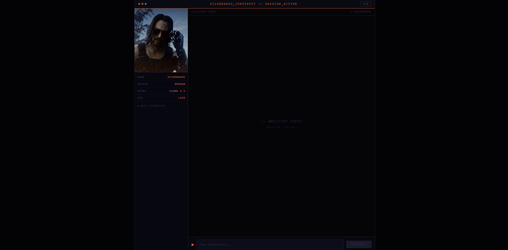

# SilverHandConstruct

An LLM-powered chatbot that lets you talk to **Johnny Silverhand** from Cyberpunk 2077 in his authentic voice. Built with React + Vite, powered by Groq's free Llama 3.3 API, and trained on hundreds of his actual in-game lines.

   

---

## Character

**Johnny Silverhand** — Rock star. Anti-corpo terrorist. Digital ghost burned into someone else's skull. Samurai frontman. Died storming Arasaka Tower in 2023.

His system prompt is loaded with hundreds of real lines pulled directly from the Cyberpunk 2077 game script.

---

## Features

- **Authentic voice** — system prompt trained on Johnny's actual in-game dialogue via few-shot prompting
- **Streaming responses** — tokens stream in real time as Johnny speaks
- **Style bank architecture** — built to support multiple characters, easy to extend by adding entries to `src/styles.js`
- **Hot reload** — changes to the style bank reflect instantly in dev

---

## Tech Stack

- **Frontend** — React 18 + Vite
- **LLM** — Llama 3.3 70B via [Groq](https://console.groq.com) (free tier)
- **Styling** — Plain CSS, no UI library
- **Prompt Engineering** — few-shot prompting with real Cyberpunk 2077 game dialogue

---

## Setup

### 1. Clone the repo

```bash
git clone https://github.com/YourUsername/SilverHandConstruct.git
cd SilverHandConstruct
```

### 2. Install dependencies

```bash
npm install
```

### 3. Get a free Groq API key

Sign up at [console.groq.com](https://console.groq.com) — free, no credit card required. Gives you access to Llama 3.3 70B with fast inference.

### 4. Add your API key

```bash
cp .env.example .env
```

Open `.env` and replace the placeholder with your key:

```
VITE_GROQ_KEY=gsk_your_actual_key_here
```

### 5. Run the dev server

```bash
npm run dev
```

Open [http://localhost:5173](http://localhost:5173) and start talking.

---

## How It Works

Johnny's persona is defined in `src/styles.js` as a system prompt injected at the start of every API call. The prompt includes:

- His backstory, worldview, and personality rules
- Hundreds of real lines from the game as few-shot examples so the model pattern-matches his exact speech rhythm

The model never sees a "helpful AI assistant" instruction — just Johnny.

---

## Project Structure

```
SilverHandConstruct/
├── src/
│   ├── App.jsx          # Chat UI + Groq streaming logic
│   ├── App.css          # Styles
│   ├── styles.js        # Johnny's persona config and system prompt
│   └── main.jsx         # React entry point
├── .env.example         # API key template
├── .gitignore           # Keeps .env out of Git
└── package.json
```
## License

MIT — do whatever you want with it. Just don't sell it to Arasaka.
